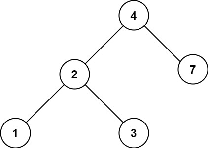

# [700. Search in a Binary Search Tree](https://leetcode.com/problems/search-in-a-binary-search-tree/)

**Difficulty:** :green_circle: Easy

You are given the `root` of a binary search tree (BST) and an integer `val`.
Find the node in the BST that the node's value equals `val` and return the subtree rooted with that node. If such a node does not exist, return `null`.

## Examples:

**Example 1:**


```
Input: root = [4,2,7,1,3], val = 2
Output: [2,1,3]

```

**Example 2:**



```
Input: root = [4,2,7,1,3], val = 5
Output: []

```

## Constraints:

- The number of nodes in the tree is in the range `[1, 5000]`.
- `1 <= Node.val <= 107`
- `root` is a binary search tree.
- `1 <= val <= 107`


## Solutions

### O(n) iterative solution 

```python3
# Definition for a binary tree node.
# class TreeNode:
#     def __init__(self, val=0, left=None, right=None):
#         self.val = val
#         self.left = left
#         self.right = right
class Solution:
    def searchBST(self, root: Optional[TreeNode], val: int) -> Optional[TreeNode]:
        if not root:
            return None

        stack = [root]
        while stack:
            node = stack.pop()

            if node.val == val:
                return node 

            if node.left:
                stack.append(node.left)

            if node.right:
                stack.append(node.right)

        return None 
```

The given solution provides an iterative approach to search for a node with the given value in a binary search tree (BST) and return the subtree rooted with that node.

Here is a step-by-step overview of the solution:

1. Check if the root is None. If it is, return None as there are no nodes to search.
2. Initialize a stack with the root node.
3. Enter a loop that continues until the stack is not empty:
   - Pop a node from the stack.
   - Check if the value of the node matches the given value `val`. If it does, return this node as it is the node with the desired value.
   - If the node has a left child and the value `val` is less than the node's value, push the left child to the stack for further search.
   - If the node has a right child and the value `val` is greater than the node's value, push the right child to the stack for further search.
4. If the loop ends and no node with the desired value is found, return None.

#### Complexity Analysis

The time complexity for this solution is O(n), where n is the number of nodes in the binary tree. In the worst case, we may need to visit all nodes.

The space complexity is O(n) in the worst case, where n is the number of nodes in the binary tree. This occurs when all nodes are pushed onto the stack.

#### Summary

The given solution provides an iterative approach to search for a node with a given value in a binary search tree (BST). It uses a stack to traverse the tree and check the values of the nodes. The solution has a time complexity of O(n) and a space complexity of O(n), where n is the number of nodes in the binary tree.


***NB***: If you want to get community points please suggest solutions in other languages as merge requests.
